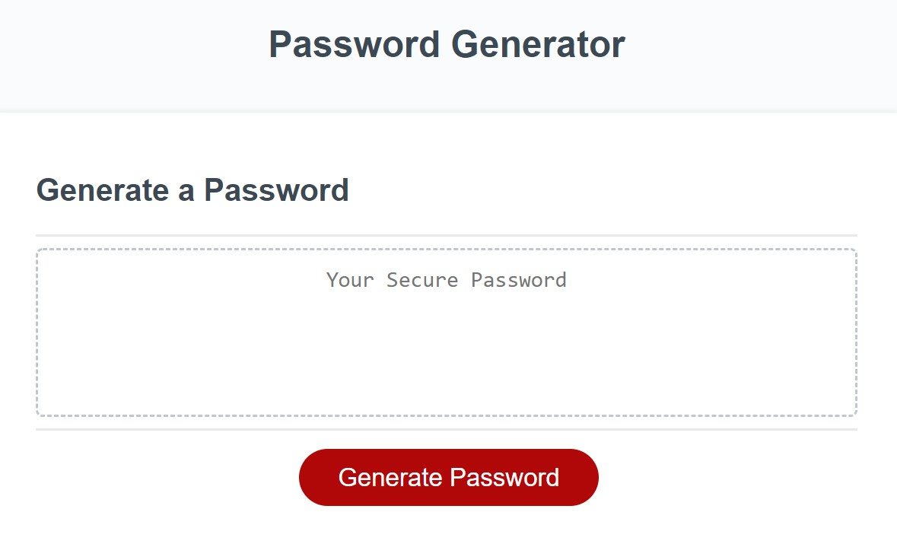

## Weekly Challenge 3

## Description
The purpose of this assignment was to have a random password generated as it says in the tasks listed below. 
I was able to get what looks like a password genertaed but was not able to get to generate an actual password.
That will have to be worked on in the future.

## Assignment Tasks
1. Have a series of prompts appear about password critieria when the generate password button is clicked
2. Have the user select criteria for the given password
3. When prompted for the password I choose a length between 8-128 characters
4. When prompted what characters to include in the password I then select lowercase, uppercase, numbers or special characters
5. When the prompts are answered my inputs are validated and at least one character type should be selected
6. When all the prompts are answerd the password matches the selected critieria
7. When the password is generated it is displayed in an alert window

## Task Achievement
I was able to complete task 1 and task 2 by using the window.prompt property in javascript. 
I was able to complete tasks 3-5 by using a recursive if condition statement. I also used if condition and else if conditon to validate the inputs for my variables.
I was able to get the majority of the critiera matching to my password though the if and else if condition statements.
I was able to have my password dispalyed as an alert by using the window.alert property.

## Link to Application
<a href="https://joker282855.github.io/Password/">Password Generator Link</a>

## Screenshot of Application

## Built With
1. HTML
2. CSS
3. Javascript

## Contributors
Made with ❤️ by Josh Jackson